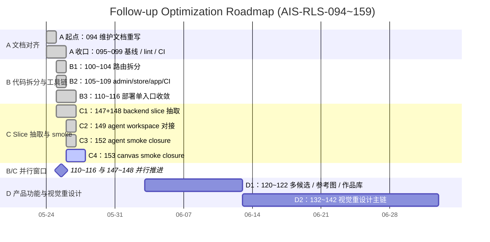

# AI Image Studio 后续优化方案（详细版）

更新日期：2026-05-24
线上版本：`20260524-user-flow-polish-v1`（commit `e592d25`，2026-05-24 11:20 UTC 启动）
仓库：`D:\生图广场\remote-edit\`
线上：`https://<host>`
适用读者：主控 agent、人工维护者、新接手贡献者

本方案在 124/124 Trellis 任务全部 Done 的状态下，做一次"已发布之后"的体检。每一项都给出：现状（含 `file:line` 与实际代码片段）→ 影响（量化）→ 改造方案（带代码示例与迁移模板）→ 验收命令 → 回滚预案。所有内容直接对照仓库现状可执行。

---

## 目录

- 第 1 章 — 当前基线（含线上探测数据）
- 第 2 章 — P0 问题（安全/质量门）
- 第 3 章 — P1 问题（性能/可维护）
- 第 4 章 — P2 问题（美观/体验）
- 第 5 章 — P3 问题（文档/产品缺口）
- 第 6 章 — 分阶段路线图与 Trellis 任务卡模板
- 第 7 章 — 具体 PR 列表（含 commit 信息草稿）
- 第 8 章 — 风险矩阵与回滚预案
- 第 9 章 — 指标看板（量化衡量）
- 第 10 章 — 与 DEVELOPMENT_GUIDE 的衔接说明

---

## 1. 当前基线

### 1.1 线上探测（2026-05-24 11:34 UTC）

| 资源 | 状态 | 大小 | TTFB | Cache 头 |
| --- | --- | --- | --- | --- |
| `GET /` | 200 | 33,289 B | 1.56 s | `no-store`（合理） |
| `GET /styles.css` | 200 | 1,453 B（仅 @import 壳） | 1.24 s | `public, max-age=14400` |
| `GET /app.js` | 200 | 325,591 B | 7.69 s（cf MISS）/ < 1 s（HIT） | `public, max-age=14400` |
| `GET /mobile.css` | 200 | 7,991 B | 1.58 s | `public, max-age=14400` |
| `GET /api/version` | 200 | — | — | `{"version":"20260524-user-flow-polish-v1","node":"v20.20.2","platform":"linux-x64"}` |

线上响应头摘要：
- `Content-Security-Policy-Report-Only`（**非强制**）：`default-src 'self'; img-src 'self' data: blob: https:; media-src 'self' https:; style-src 'self' 'unsafe-inline' https://fonts.googleapis.com https://cdn.jsdelivr.net; font-src 'self' https://fonts.gstatic.com https://cdn.jsdelivr.net; script-src 'self'; connect-src 'self'; report-uri /api/csp-report`
- `Permissions-Policy: camera=(), microphone=(), geolocation=()` ✓
- `Referrer-Policy: strict-origin-when-cross-origin` ✓
- `X-Content-Type-Options: nosniff` ✓
- Cloudflare `cf-cache-status: DYNAMIC`（HTML 不缓存）/ `HIT`（静态资源）

### 1.2 仓库代码体量

| 文件 | 行 | 字节 | 说明 |
| --- | --- | --- | --- |
| `public/app.js` | 7,241 | 325,591 | 全局 state 入口（第 1 行起，约 85 个字段） |
| `public/admin.js` | 2,052 | 101 KB | 管理端入口 |
| `server.js` | 4,387 | 167 KB | HTTP 入口 + 14 处内联路由 |
| `src/mysql-store.js` | 1,633 | 80 KB | 连接池 + migration + façade |
| `src/routes/admin.js` | 1,170 | 51 KB | 31 个 `/api/admin/*` |
| `src/stores/prompt-store.js` | 1,183 | 47 KB | 最大子 store |
| `public/canvas.js` | 1,216 | 43 KB | Canvas v1 入口 |
| `public/index.html` | 564 | 33 KB | 5 个 CSS + 29 个 JS |

### 1.3 任务与文档基线

- `.trelis/tasks/` 共 124 个目录，全部 `status: done`（与 `PROJECT_PROGRESS_STATUS.md` 一致）。
- 文档中存在 3 个"事实漂移"点（见 P0-3）。
- 视觉回归最近一次产物：`docs/mobile-qa/visual-regression/runs/2026-05-24T09-58-42-216Z/summary.md`，10 个 scenario 全部 `Pass | missing-baseline`。

---

## 2. P0 — 影响安全/质量门

### P0-1. CSP 长期处于 Report-Only

**现状**
- 线上响应头返回 `Content-Security-Policy-Report-Only`，从未切换 enforce。
- 策略已合理：`script-src 'self'`、`connect-src 'self'`、`img-src 'self' data: blob: https:`（外站图像放宽是必要的，因为生成图可能存在外部 URL）、`media-src 'self' https:`（hero 视频依赖）、`style-src 'self' 'unsafe-inline' https://fonts.googleapis.com https://cdn.jsdelivr.net`。
- `'unsafe-inline'` 仅在 style 上保留；脚本无任何 inline 例外，迁移成本低。

**影响**
- XSS 防护实际为"软"。若有恶意脚本注入到用户内容（评论、prompt、画布 metadata），目前不会被浏览器拦截。
- 攻击面与 enforce 后无区别，但收益（拦截）从来没有变现。

**改造方案**

阶段化切换（避免一次性切硬导致大量 violation 阻断）：

1. **数据采集阶段（1 周）**：
   ```bash
   docker compose exec app sh -lc 'tail -F /var/log/app/csp-report.log | head -100'
   # 或读 MySQL 中 csp_report 表，若 /api/csp-report 落库
   ```
   每天导出 violation 摘要：来源 directive、blocked-uri、source-file。
2. **修复阶段**：把高频 violation 来源（如果有）加白名单或就地修复。预期主要噪声来自浏览器扩展，可在 `report-uri` 处理时根据 `User-Agent` 过滤。
3. **小流量灰度**：在 `server.js` 中对 5% 请求按 `req.headers['x-forwarded-for']` hash 切换：
   ```js
   const enforceCsp = hashHeader(req) % 20 === 0; // 5%
   const cspHeaderName = enforceCsp
     ? "Content-Security-Policy"
     : "Content-Security-Policy-Report-Only";
   res.setHeader(cspHeaderName, cspPolicy);
   ```
4. **全量切换**：观察 48h 无新增报错后，把灰度提升到 100%，删除 `Report-Only` 分支。

**验收**
- 线上 `curl -I https://<host>/` 返回 `Content-Security-Policy:` 而非 `-Report-Only`。
- `npm run smoke:public -- https://<host>` 全绿。
- 48h CSP report 入站量回落到与灰度前同量级（背景噪声）。

**回滚**：单一环境变量 `CSP_ENFORCE=false` 切回 Report-Only，无需重新部署。

---

### P0-2. 视觉回归无 baseline，等于摆设

**现状**
- `docs/mobile-qa/visual-regression/runs/2026-05-24T09-58-42-216Z/summary.md` 10 个 scenario 全部 `Baseline: missing-baseline`，文字标注 "promote this screenshot only after manual approval"。
- 当前 harness 只能在 scenario 抓取失败、DOM 锚点缺失、脚本崩溃时报错，**不能检测视觉差异**。
- 已知警告未处理：`home-composer-light-desktop: no visible cards for .example-card`。

**影响**
- 任何一次 CSS/HTML 改动可能导致组件错位、对齐丢失、暗色模式断裂，CI 无法拦截。
- 视觉回归手段当前只剩"人工跑一遍 + 看截图"，与文档承诺的"自动断言"不符。

**改造方案**

1. **当前一次 promote**：人工逐张审 10 张截图，可接受的写入 `docs/mobile-qa/baseline-local/`：
   ```powershell
   cd D:\生图广场\remote-edit
   npm run smoke:visual-regression
   # 阅读最新 runs/<ts>/summary.md 与 PNG
   # 把通过审阅的截图复制到 baseline-local
   Copy-Item docs\mobile-qa\visual-regression\runs\<ts>\*.png docs\mobile-qa\baseline-local\
   ```
2. **修改脚本启用差异断言**：`scripts/smoke/check-visual-regression.mjs` 在有 baseline 时跑像素 diff（阈值 5% 像素差异），无 baseline 时仍走 "missing-baseline warning" 但**记录 warning 总数**，超过 3 个即 fail。
3. **修复 `example-card` 警告**：在 `public/css/05-home.css` 检查 `.example-card` 选择器，确认是否被新版 home-onboarding 替换；必要时移除旧 scenario 或更新选择器。
4. **CI 接入**：把 `npm run smoke:visual-regression` 列入 release 必跑（写进 `IMAGE_STUDIO_QA_RELEASE_CHECKLIST.md` 的 P0 视觉项）。

**验收**
- `npm run smoke:visual-regression` 输出 `summary.md` 中至少 8 个 scenario 显示 `Baseline: matched`（容许 mobile/dark 暂时 missing 但有 follow-up 任务）。
- 故意改一处颜色（如 `--brand-primary` 偏移 10%）后，脚本必须 fail。

**回滚**：删除新增 baseline 文件，恢复 missing-baseline 兜底逻辑。

---

### P0-3. `CODE_MAINTENANCE_OPTIMIZATION.md` 自我矛盾

**现状**
- 文档顶部声明 "AIS-RLS-070 ~ 093 全部 Done，Trellis 无 active 任务"。
- 文档第三/四/五节仍把这些列为 `☐ 待做`：`user-store.js`、`admin.js` 路由拆分、`app-auth.js`、`app-settings.js`、`app-generation.js`、`app-gallery.js`、`admin-users.js`、`images.js` 路由、`canvases.js` 路由。
- 实际盘点：
  - `src/stores/user-store.js`（24 KB）存在
  - `src/routes/admin.js`（51 KB / 1,170 行）存在
  - `src/routes/images.js`（3.2 KB，但只覆盖 `/api/images/:id/file` 2 个端点，未覆盖 `/api/images/history`、`/api/images/bulk`、`/api/images/generate`、`/api/images/edit` 等 6 个仍在 `server.js` 中的端点）
  - `public/app-auth.js`、`public/app-settings.js` **不存在**

**影响**
- 文档既不能作为"已完成清单"也不能作为"待办清单"。
- 后续 agent 按其执行会要么重复劳动，要么误判已完成。

**改造方案**

重写文档为三块：
1. **已落地**（带 `file:line` 指向真实代码）
2. **真实剩余**（按本方案 P1 / P2 列出，含验收命令）
3. **历史背景**（旧的"5,612 行 server.js"等数据移到附录，标注"截止 commit XXX 的快照"）

模板：

```markdown
## 已落地（截至 2026-05-24，commit e592d25）

| 区域 | 模块 | 入口 |
| --- | --- | --- |
| Store | user-store | src/stores/user-store.js |
| Store | gallery-store | src/stores/gallery-store.js |
| ... |

## 真实剩余拆分

### 1. server.js 内联路由（8 个端点，~600 行）
现状：server.js:3217-3812
迁移目标：
- /api/checkin、/api/credits/detail → src/routes/credits.js
- /api/settings、/api/growth → src/routes/settings.js
- /api/announcements*、/api/stats/today → src/routes/announcements.js
- /api/images/history、/bulk、/generate、/edit、/requests/active → 并入 src/routes/images.js
验收：npm run smoke:server-route-boundary-split && smoke:public
```

**验收**：`grep "☐ 待做" docs/CODE_MAINTENANCE_OPTIMIZATION.md` 输出为空。

**回滚**：仍保留原文档作为 `archive/CODE_MAINTENANCE_OPTIMIZATION_v1.md` 以备查阅。

---

## 3. P1 — 影响性能/可维护

### P1-1. `public/app.js` 7,241 行 / 325 KB 单文件

**现状**

`public/app.js:1` 起就是全局 `state` 对象：

```js
const state = {
  lang: localStorage.getItem("lang") || "zh",
  user: null,
  settings: null,
  // ... 约 85 个字段，覆盖 home / editor / gallery / sessions / generation / checkin / canvas / library / works / continuation / tags / csrf
  csrfToken: ""
};
```

线上首次回源 `GET /app.js` TTFB 7.69 s（cf-cache MISS）。CDN HIT 后约 1 s 内传输。`scripts/smoke/check-frontend-boundaries.mjs` 中 `maxLines: 7350` 距当前 7,241 行只剩 109 行余量。

**影响**
- 首屏关键路径 JS 体积失控。即便所有 `AppModules` 桥接已经把 render 抽出去，**入口 JS 仍是单体下载**。
- 移动 4G 弱网下首屏 LCP 容易超过 4 s。
- 模块边界 smoke 距上限太近，下一个功能会撞顶。

**改造方案 — 分两步，互不阻塞**

**Step A（机械拆分，不改语义）— 立刻可做**

把以下两块从 `app.js` 切出：

1. **`public/app-auth.js`**（目标 ~600 行）
   - 登录/注册 modal 渲染与表单提交
   - 账号菜单（avatar、creditsBtn、myWorksBtn、adminBtn、logoutBtn）
   - CSRF token 获取与刷新
   - 路由保护逻辑（`pendingAuthView`）

2. **`public/app-settings.js`**（目标 ~400 行）
   - i18n（`state.lang`、`window.applyI18n()`）
   - theme 同步（与 `theme-mobile-nav.js` 通信）
   - 用户偏好（continuationMode、worksFilter）
   - localStorage 读写包装

迁移模板（以 `app-auth.js` 为例）：

```js
// public/app-auth.js
(function (global) {
  "use strict";
  const AppModules = global.AppModules = global.AppModules || {};

  function setupAuthBindings({ state, i18n, requestJson, refreshSession }) {
    document.getElementById("loginBtn")?.addEventListener("click", () => openAuthModal({ state, i18n, mode: "login" }));
    document.getElementById("logoutBtn")?.addEventListener("click", () => doLogout({ state, requestJson, refreshSession }));
    // ... 其余绑定
  }

  async function openAuthModal({ state, i18n, mode }) { /* ... */ }
  async function doLogout({ state, requestJson, refreshSession }) { /* ... */ }

  AppModules.auth = { setupAuthBindings, openAuthModal, doLogout };
})(window);
```

`app.js` 中保留单行调用：

```js
window.AppModules?.auth?.setupAuthBindings({
  state, i18n, requestJson, refreshSession
});
```

**Step B（按路由 lazy load）— 阶段 C 落地**

把 `admin`、`canvas`、`agent` 三块从首屏 bundle 中剥离，只在用户进入对应路由后动态注入 `<script>`：

```js
// public/app-router.js（新增）
const lazyModules = {
  admin: { js: "/admin.js", css: ["/css/09-admin.css", "/css/09-admin-panels.css"] },
  canvas: { js: "/canvas.js", css: ["/css/10-canvas.css", "/css/10-canvas-tools.css"] },
  agent: { js: "/agent.js", css: [] }
};

async function ensureModule(name) {
  const m = lazyModules[name];
  if (!m || m.loaded) return;
  m.loaded = true;
  await Promise.all([
    ...m.css.map(href => injectStyle(href)),
    injectScript(m.js)
  ]);
}

document.addEventListener("click", (e) => {
  const target = e.target.closest("[data-route-target]");
  if (!target) return;
  ensureModule(target.dataset.routeTarget);
});
```

**验收**

- Step A 完成：
  - `wc -l public/app.js` ≤ 6,200 行
  - `npm run smoke:public-app-module-split` 通过且包含 `app-auth` `app-settings` 断言
  - `npm run smoke:frontend-a11y && smoke:user-flow-polish && smoke:visual-regression` 全绿
- Step B 完成：
  - 首屏 `app.js` 下载大小（gzip 前）≤ 180 KB
  - 进入 `/admin` 前 admin.js 不下载（用 DevTools Network 截图存档）

**回滚**：每个新模块都用 `if (!AppModules.auth) { /* inline fallback */ }` 兜底，恢复时只需删除 `<script src="/app-auth.js">` 即可。

---

### P1-2. `styles.css` @import 瀑布

**现状**

`public/styles.css` 整个文件 34 行，全部是 `@import`（线上 1,453 B）：

```css
@import "css/00-tokens.css";
@import "css/00-theme.css";
@import "css/01-reset.css";
/* ... 共 33 个 import */
@import "css/13-performance.css";
```

浏览器拿到 `styles.css` 后必须**依次发起 33 次额外 HTTP 请求**才能完成首屏 CSS。再加上 4 个 `mobile-*.css` 和 2 个外部 CDN 字体，首屏 CSS 请求总数 ≈ **40**。

**影响**

- 关键渲染路径被人为延长。每个 @import 是新的 RTT。
- `public/css/12-animations.css` 仅 145 B（基本是注释占位符），仍触发独立请求：

  ```css
  /* AIS-RLS-071 semantic placeholder.
     Existing keyframes remain in order-preserving split chunks; AIS-RLS-072+ can move them here safely. */
  ```

**改造方案**

在 `scripts/frontend/build-public-modules.mjs` 增加 CSS 合并入口：

```js
// scripts/frontend/build-public-modules.mjs (新增片段)
import { readFileSync, writeFileSync } from "node:fs";
import { createHash } from "node:crypto";
import { join } from "node:path";

const CSS_ORDER = [
  "00-tokens", "00-theme", "01-reset", "02-typography",
  "03-layout", "03-layout-shell",
  "04-components", "04-components-cards", "04-components-modals", "04-components-forms",
  "05-home", "05-home-onboarding", "05-home-composer",
  "06-gallery", "06-credits-detail", "06-works-carousel",
  "06-prompt-library-polish", "06-gallery-detail",
  "06-gallery-leaderboard", "06-gallery-leaderboard-responsive",
  "07-editor", "08-chat", "08-chat-polish",
  "09-admin", "09-admin-panels", "09-admin-diagnostics", "09-admin-shell-polish",
  "10-canvas", "10-canvas-tools",
  "11-mobile", "12-animations", "12-visual-polish", "13-performance"
];

const merged = CSS_ORDER
  .map(name => `/* ${name} */\n${readFileSync(`public/css/${name}.css`, "utf8")}`)
  .join("\n\n");

const hash = createHash("sha256").update(merged).digest("hex").slice(0, 12);
const outName = `app.${hash}.css`;
writeFileSync(`public/dist/${outName}`, merged);

// 写入 manifest 供 server.js 读取
writeFileSync("public/frontend-build-manifest.json", JSON.stringify({
  ...existingManifest,
  css: { entry: `/dist/${outName}` }
}, null, 2));
```

`server.js` 已有 manifest 读取（参考 `src/frontend/app-build-manifest.mjs`），在 HTML 渲染时把 `<link rel="stylesheet" href="/styles.css?v=...">` 替换为 manifest 中的 entry 引用。

`mobile.css` / `mobile-home.css` / `mobile-gallery.css` / `mobile-editor.css` 一并并入 CSS_ORDER，统一入口。`public/styles.css`（@import 壳）保留为兼容兜底，但 HTML 不再引用。

**验收**

- `curl -I https://.../dist/app.<hash>.css` 返回 200，Content-Length 在 180-220 KB（合并后压缩前）
- 浏览器 DevTools Network：首屏 CSS 请求数从 5 + 33 @import 降到 1
- `npm run smoke:css-module-split` 仍通过（断言每个模块的关键选择器仍存在）
- `npm run smoke:visual-regression` 与 baseline 一致

**回滚**：HTML 中改回 `<link rel="stylesheet" href="/styles.css?v=...">`，删除 manifest CSS 字段，构建产物不被引用即失效。

---

### P1-3. `server.js` 仍持 8 个内联 `/api/*` 路由（约 600 行）

**现状（精确位置）**

`server.js:3215` 之后 `handleAdminRoute` 返回 false 的兜底路径里：

| 位置 | 端点 | 方法 |
| --- | --- | --- |
| `server.js:3217` | `/api/checkin` | POST |
| `server.js:3238` | `/api/credits/detail` | GET |
| `server.js:3259` | `/api/settings` | GET |
| `server.js:3264` | `/api/growth` | GET |
| `server.js:3274` | `/api/announcements` | GET |
| `server.js:3281` | `/api/announcements/unread` | GET |
| `server.js:3295` | `/api/announcements/:id/(read\|ack)` | POST |
| `server.js:3307` | `/api/stats/today` | GET |
| `server.js:3315` | `/api/images/history` | GET |
| `server.js:3418` | `/api/images/bulk` | POST |
| `server.js:3524` | `/api/images/generate` | POST |
| `server.js:3763` | `/api/images/edit` | POST |

例如 `/api/checkin` 现在是这样：

```js
// server.js:3217
if (req.method === "POST" && url.pathname === "/api/checkin") {
  const current = await getCurrentUser(req);
  ensureAuthenticated(current);
  const user = await store.getUserById(current.user.id);
  if (!user || user.status !== "active") {
    throw httpError("Account is not active", 403);
  }
  const result = await store.checkInToday(user.id, CHECKIN_CREDIT);
  const updatedUser = await store.getUserById(user.id);
  return sendJson(res, 200, { /* ... */ });
}
```

**影响**

- `server.js` 仍是 god-file，单文件 PR 评审范围过大。
- `src/routes/images.js`（参考 `src/routes/images.js:1-95`）只覆盖 `:id/file` 两个端点，名不副实。
- store 拆分意义被打折扣——这 8 个端点直接调用 `store.checkInToday` `store.listCreditLedger` `store.listPublishedAnnouncements` 等，把"业务逻辑"留在了 server.js 顶层。

**改造方案 — 按 `src/routes/images.js` 的工厂模式扩展**

参考现有 `src/routes/images.js` 的工厂函数模式（`createImagesRoute({ store, sendJson, ... })`），新增：

```js
// src/routes/credits.js（新增）
"use strict";

function createCreditsRoute({
  store,
  sendJson,
  httpError,
  getCurrentUser,
  ensureAuthenticated,
  serializeUser,
  CHECKIN_CREDIT
}) {
  return async function handleCreditsRoute(req, res, url) {
    if (req.method === "POST" && url.pathname === "/api/checkin") {
      const current = await getCurrentUser(req);
      ensureAuthenticated(current);
      const user = await store.getUserById(current.user.id);
      if (!user || user.status !== "active") {
        throw httpError("Account is not active", 403);
      }
      const result = await store.checkInToday(user.id, CHECKIN_CREDIT);
      const updatedUser = await store.getUserById(user.id);
      sendJson(res, 200, {
        checkedIn: result.checkedIn,
        awarded: result.checkedIn ? CHECKIN_CREDIT : 0,
        credits: result.credits,
        user: serializeUser(updatedUser),
        checkin: { checkedInToday: true, credit: CHECKIN_CREDIT }
      });
      return true;
    }

    if (req.method === "GET" && url.pathname === "/api/credits/detail") {
      const current = await getCurrentUser(req);
      ensureAuthenticated(current);
      const limit = Math.max(1, Math.min(120, Number(url.searchParams.get("limit")) || 80));
      const [ledger, rewards, credits, checkedInToday] = await Promise.all([
        store.listCreditLedger({ userId: current.user.id, limit }),
        store.listRewardLedger({ userId: current.user.id, limit: Math.min(limit, 80) }),
        store.getUserCredits(current.user.id),
        store.hasCheckedInToday(current.user.id)
      ]);
      sendJson(res, 200, {
        credits, ledger, rewards,
        checkin: { checkedInToday, credit: CHECKIN_CREDIT }
      });
      return true;
    }

    return false;
  };
}

module.exports = { createCreditsRoute };
```

`server.js` 中接线：

```js
// 在 handleCanvasesRoute 与 handleAdminRoute 之间插入
const handleCreditsRoute = createCreditsRoute({
  store, sendJson, httpError, getCurrentUser,
  ensureAuthenticated, serializeUser, CHECKIN_CREDIT
});

// 原来的 inline 路由删除，替换为：
if (await handleCreditsRoute(req, res, url)) return;
```

**迁移分批 PR**（每个 PR 一个工厂文件，避免大改）：

| PR | 新建文件 | 迁出端点 | server.js 行数变化 |
| --- | --- | --- | --- |
| 1 | `src/routes/credits.js` | `/api/checkin`、`/api/credits/detail` | -40 |
| 2 | `src/routes/settings-public.js` | `/api/settings`、`/api/growth` | -20 |
| 3 | `src/routes/announcements.js` | `/api/announcements*`、`/api/stats/today` | -120 |
| 4 | `src/routes/images.js`（扩展） | `/api/images/history`、`/bulk` | -300 |
| 5 | `src/routes/images-generate.js` | `/api/images/generate`、`/edit` | -700 |

**验收（每个 PR）**

```powershell
cd D:\生图广场\remote-edit
node --check server.js
node --check src\routes\credits.js
npm run smoke:public
npm run smoke:server-route-boundary-split
npm run smoke:auth-admin
```

- `server.js` 行数应在每个 PR 后递减，最终目标 ≤ 1,800 行。
- 任一端点响应 schema 与原 `server.js` 完全等价（用 `diff` 抓 `npm run smoke:public` 的产物对比）。

**回滚**：每个 PR 独立可回滚，删除新增 route 文件、恢复 `server.js` 中的 inline 块即可。建议保留 `server.js` 中相应的 inline 实现一个版本（用 `if (false)` 包起来），下一个 release 验证无问题再删除。

---

### P1-4. `src/routes/admin.js` 是新的 god-route

**现状**

`src/routes/admin.js:6-51` 工厂函数注入 **45 个依赖**：

```js
function createAdminRoute({
  store, promptReview, sendJson, readJsonBody, httpError, randomId,
  getCurrentUser, ensureAuthenticated, ensureAdmin, sanitizePositiveInt,
  writeAdminAudit, cleanPromptSourceInput, runPromptSourceSync,
  reviewPendingPromptDuplicates, adminSettings, cleanProviderInput,
  normalizeProviderMapping, runProviderMappingRequest, fetchWithTimeout,
  DEFAULT_MODEL, extractImageItems, isSafeRemoteImageUrl, rumSummary, rumEvents,
  cleanAnnouncementInput, normalizeMaxReferenceImages, normalizeEmail,
  requireOptionalEmail, serializeUser, sourceImageUrlForGeneration,
  sourceImageAuditFields, generationResponse, callOpenAITextResponses,
  notifyWithdrawalDecision, notifyModerationOutcome, temporaryPassword,
  requireEmail, requirePassword, hashPassword, recoveredGenerationJobFromRequest,
  enqueueGenerationJob, cancelQueuedGenerationJob, traceGeneration,
  runGalleryFileChecks
}) { /* ... */ }
```

并在 1,170 行内串联 31 个 `/api/admin/*` 端点（53、65、164、173、185、317、325、335、416、482、508、517、526、535、580、595、605、615、774、823、869、1004、1018、1031、1047 …）。

**影响**
- 单测试不可能，注入面过大。
- 一个 admin PR 平均触碰 admin.js 几百行，diff 阅读疲劳。
- 与 `FRONTEND_MODULE_BOUNDARIES.md` 的 admin 分块原则相悖。

**改造方案 — 按业务域拆分**

目标目录：

```
src/routes/admin/
  index.js                  // 聚合 + 路由分发
  prompt-sources.js         // /api/admin/prompt-sources*
  users.js                  // /api/admin/users*
  public-images.js          // /api/admin/public-images*
  diagnostics.js            // /api/admin/diagnostics*、/api/admin/rum*
  announcements.js          // /api/admin/announcements*
  settings.js               // /api/admin/settings、/api/admin/providers*
  moderation.js             // /api/admin/moderation*、/withdrawals*
  generations.js            // /api/admin/generations*、/trace*
```

`src/routes/admin/index.js` 模板：

```js
"use strict";

const { createPromptSourcesRoute } = require("./prompt-sources");
const { createUsersRoute } = require("./users");
// ... 其余 import

function createAdminRoute(deps) {
  const handlers = [
    createPromptSourcesRoute(deps),
    createUsersRoute(deps),
    createPublicImagesRoute(deps),
    createDiagnosticsRoute(deps),
    createAnnouncementsAdminRoute(deps),
    createAdminSettingsRoute(deps),
    createModerationRoute(deps),
    createGenerationsAdminRoute(deps)
  ];

  return async function handleAdminRoute(req, res, url) {
    for (const handle of handlers) {
      if (await handle(req, res, url)) return true;
    }
    return false;
  };
}

module.exports = { createAdminRoute };
```

每个子路由只拿自己需要的依赖：

```js
// src/routes/admin/users.js
function createUsersRoute({
  store, sendJson, readJsonBody, httpError,
  getCurrentUser, ensureAuthenticated, ensureAdmin,
  writeAdminAudit, serializeUser, requireEmail, requirePassword,
  hashPassword, temporaryPassword
}) {
  return async function handleUsersRoute(req, res, url) {
    if (req.method === "GET" && url.pathname === "/api/admin/users") { /* ... */ }
    if (req.method === "POST" && url.pathname === "/api/admin/users") { /* ... */ }
    const match = url.pathname.match(/^\/api\/admin\/users\/([^/]+)$/);
    if (match && req.method === "PUT") { /* ... */ }
    return false;
  };
}

module.exports = { createUsersRoute };
```

**验收**
- 每个子文件 ≤ 400 行，依赖列表 ≤ 12 项。
- `npm run smoke:admin-module-split` 增加新断言：检查 8 个子文件存在，每个有 module.exports。
- `npm run smoke:auth-admin && smoke:moderation-withdrawal && smoke:admin-generation-diagnostics` 全绿。

**回滚**：保留 `src/routes/admin.js` 一个 release 周期，启用环境变量 `ADMIN_ROUTE_LEGACY=1` 让 server.js 走旧路径。

---

### P1-5. `src/mysql-store.js` 手工 façade

**现状**

`src/mysql-store.js` 末尾约 25 行手工聚合：

```js
// 末尾示意（实际位置 mysql-store.js:1608-1633 附近）
module.exports = {
  ...userStore,
  ...adminStore,
  ...galleryStore,
  ...generationStore,
  ...canvasStore,
  ...agentSessionStore,
  ...tagStore,
  ...promptStore,
  // 手写补充
  getConnection,
  withTransaction,
  ensureSchema
};
```

新增 store 函数必须改两个地方。

**影响**
- 调用方 `server.js`、`src/routes/*` 通过 `store.xxx` 拿不到新函数即报 `undefined is not a function`，且错误延迟到运行时。

**改造方案 — 程序化 re-export**

```js
// src/mysql-store.js（末尾改为）
const subStores = {
  user: require("./stores/user-store"),
  admin: require("./stores/admin-store"),
  gallery: require("./stores/gallery-store"),
  generation: require("./stores/generation-store"),
  canvas: require("./stores/canvas-store"),
  agentSession: require("./stores/agent-session-store"),
  tag: require("./stores/tag-store"),
  prompt: require("./stores/prompt-store")
};

const moduleExports = {
  getConnection,
  withTransaction,
  ensureSchema
};

for (const [domain, factory] of Object.entries(subStores)) {
  const created = typeof factory === "function" ? factory({ getConnection, withTransaction }) : factory;
  for (const [name, fn] of Object.entries(created)) {
    if (name in moduleExports) {
      throw new Error(`Store export collision: ${name} already provided before ${domain}`);
    }
    moduleExports[name] = fn;
  }
}

module.exports = moduleExports;
```

**验收**
- 增加 `scripts/smoke/check-mysql-store-exports.mjs` 断言 `Object.keys(store).length` ≥ 当前数量且没有 collision。
- 故意在 `user-store.js` 与 `admin-store.js` 同时导出 `getUserById`，运行启动应抛错。
- `npm run smoke:mysql-store-domain-split` 仍通过。

**回滚**：手工 façade 改回。

---

### P1-6. 无 lint / 无单测 / 无类型 / 无 CI

**现状**
- `package.json:96-98` 仅声明 `mysql2`；`devDependencies` 缺失。
- 73 个 npm script 全是 `start` + `*:check`（apps/canvas-v2 子项目）+ 66 个 `smoke:*`。
- 无 `.eslintrc*`、`.prettierrc*`、`biome.json`、`tsconfig.json`、`vitest.config.*`。
- 无 `.github/workflows/`。

**影响**
- 一切质量门集中在 e2e-style smoke，无法在本地 < 5 s 拿到反馈。
- 提交时只能靠 `git diff --check` + `node --check`。
- 新人无统一格式约束，代码风格漂移。

**改造方案 — 最小可用集**

**1. ESLint 9 + flat config**

`eslint.config.mjs`:

```js
import js from "@eslint/js";
import globals from "globals";

export default [
  js.configs.recommended,
  {
    files: ["public/**/*.js", "src/**/*.js", "scripts/**/*.{js,mjs}", "server.js"],
    languageOptions: {
      ecmaVersion: 2024,
      sourceType: "commonjs",
      globals: { ...globals.node, ...globals.browser }
    },
    rules: {
      "no-unused-vars": ["warn", { argsIgnorePattern: "^_", varsIgnorePattern: "^_" }],
      "no-undef": "error",
      "no-prototype-builtins": "off",
      "no-empty": ["error", { allowEmptyCatch: true }]
    }
  },
  {
    files: ["public/**/*.js"],
    languageOptions: { sourceType: "script", globals: globals.browser },
    rules: { "no-undef": "off" } // 太多全局 window.* 桥接，先放过
  },
  {
    ignores: ["node_modules/**", "external/**", "apps/**/node_modules/**", "public/canvas-v2/assets/**", "public/agent/assets/**", "data*/**", "tmp/**"]
  }
];
```

`package.json` 增补：

```json
{
  "devDependencies": {
    "eslint": "^9.20.0",
    "@eslint/js": "^9.20.0",
    "globals": "^15.14.0",
    "prettier": "^3.4.2"
  },
  "scripts": {
    "lint": "eslint .",
    "lint:fix": "eslint . --fix",
    "format:check": "prettier --check \"{src,public,scripts}/**/*.{js,mjs,css}\"",
    "check": "node --check server.js && npm run lint && npm run smoke:frontend-boundaries && npm run smoke:frontend-build-tooling"
  }
}
```

**2. Vitest 单测（仅纯函数）**

只对以下文件加测试，不强求覆盖率：
- `src/provider-mapping.js`
- `src/agent-planner.js`
- `src/prompt-source-sync.js`（纯解析函数部分）

`vitest.config.mjs`:

```js
import { defineConfig } from "vitest/config";

export default defineConfig({
  test: {
    include: ["src/**/*.test.js"],
    environment: "node"
  }
});
```

`src/provider-mapping.test.js` 示例：

```js
const { describe, it, expect } = require("vitest");
const { normalizeProviderMapping } = require("./provider-mapping");

describe("normalizeProviderMapping", () => {
  it("falls back to default when mapping is empty", () => {
    expect(normalizeProviderMapping({})).toMatchObject({ provider: "openai" });
  });
  it("preserves explicit model when provided", () => {
    expect(normalizeProviderMapping({ model: "gpt-image-1" }).model).toBe("gpt-image-1");
  });
});
```

**3. GitHub Actions CI**

`.github/workflows/check.yml`:

```yaml
name: check
on:
  push: { branches: [main] }
  pull_request:
    branches: [main]

jobs:
  check:
    runs-on: ubuntu-latest
    steps:
      - uses: actions/checkout@v4
      - uses: actions/setup-node@v4
        with: { node-version: "20.20.2", cache: "npm" }
      - run: npm ci
      - run: node --check server.js
      - run: npm run lint
      - run: npm run smoke:frontend-boundaries
      - run: npm run smoke:frontend-build-tooling
      - run: npm test --if-present
```

**验收**
- `npm run lint` 在干净仓库下 ≤ 20 s 完成且无 error（warning 可有）。
- `npm test` ≥ 5 个测试通过。
- 推送一个故意带 `var x = 1; if (x = 2) {}` 的 PR，CI 应失败。

**回滚**：删除 `eslint.config.mjs` 与 workflow，npm script 中 lint/test/check 不会阻塞 start。

---

### P1-7. 缓存 query 字符串手工维护

**现状**

`public/index.html:15-19` 五个 CSS：

```html
<link rel="stylesheet" href="/styles.css?v=20260524-user-flow-polish-v1">
<link rel="stylesheet" href="/mobile-gallery.css?v=20260523-mobile-route-modal-v2">
<link rel="stylesheet" href="/mobile.css?v=20260523-mobile-route-modal-v2">
<link rel="stylesheet" href="/mobile-home.css?v=20260523-mobile-route-modal-v2">
<link rel="stylesheet" href="/mobile-editor.css?v=20260523-mobile-route-modal-v2">
```

29 个 `<script>` 标签（`public/index.html:525-562`）同样手工标版本，版本散落在 5 个不同字符串。

**影响**
- 每次发布要人改、容易漏。
- 线上 `Cache-Control: public, max-age=14400`（4h）叠加漏改的 query 串，会让最长 4 h 的用户拿到旧脚本。

**改造方案**

服务端在响应 `/` 时基于 `public/frontend-build-manifest.json` 注入 hash：

```js
// server.js 渲染 / 时（伪代码）
const manifest = readManifest();
const html = baseHtml
  .replace(/\/styles\.css\?v=[^"']+/g, manifest.css.entry)
  .replace(/\/app\.js\?v=[^"']+/g, manifest.js.entry)
  .replace(/\/admin\.js\?v=[^"']+/g, manifest.js.admin);
```

更彻底的做法是把 HTML 改成模板，用 `<link rel="stylesheet" href="{{cssEntry}}">` 占位。

构建产物使用 content hash（如 `app.6f3a9c.js`），`Cache-Control` 可以放心切 `public, max-age=31536000, immutable`。

**验收**
- 线上 `curl -s https://.../ | grep -oE 'app\.[0-9a-f]+\.js'` 输出 hash 形式。
- 同一次部署中 hash 保持稳定，下一次部署后 hash 改变。
- `Cache-Control: max-age=31536000, immutable`（限静态产物，HTML 仍 `no-store`）。

**回滚**：模板改回静态文件名 + 手工 query。

---

## 4. P2 — 影响美观/体验

### P2-1. Hero 视频硬编码 CloudFront 链接

**现状**

`public/index.html:127-131`：

```html
<section class="hero">
  <div class="hero-video-layer" aria-hidden="true">
    <video ...>
      <source src="https://d8j0ntlcm91z4.cloudfront.net/user_38xz.../hf_20260302_....mp4" type="video/mp4">
    </video>
    <div class="hero-video-gradient"></div>
  </div>
```

CSP `media-src 'self' https:` 因此放行所有 https 媒体源。

**改造方案**

1. 把视频本地化：下载到 `public/hero/hero.mp4`（建议 < 2 MB，720p 8 s 循环）。
2. 提供 `poster="/hero/hero-poster.webp"`（< 60 KB）。
3. 提供低带宽 fallback：CSS 渐变 + 静态海报，当 `connection.effectiveType === "slow-2g"` 时不加载视频。
4. CSP `media-src 'self'`，去掉 `https:` 放宽。

代码示例（`public/theme-mobile-nav.js` 或新增 `public/hero-video.js`）：

```js
(function () {
  const v = document.querySelector(".hero-video-layer video");
  if (!v) return;
  const conn = navigator.connection;
  if (conn && (conn.saveData || ["slow-2g", "2g"].includes(conn.effectiveType))) {
    v.removeAttribute("autoplay");
    v.preload = "none";
    v.poster = "/hero/hero-poster.webp";
  }
})();
```

**验收**
- 阻断 CloudFront 域名（hosts 127.0.0.1）首屏仍美观。
- 视觉回归 home scenario baseline 不变。
- CSP `media-src 'self'` 后 `npm run smoke:public` 与人工浏览均正常。

---

### P2-2. 移动端 CSS 两套并存

**现状**
- `public/css/11-mobile.css`（4.5 KB，在 `styles.css` 的 @import 链里）
- `public/mobile.css`（7.5 KB）、`public/mobile-home.css`（2 KB）、`public/mobile-gallery.css`（9.1 KB）、`public/mobile-editor.css`（14.5 KB）

两套断点（≤ 640、≤ 768、≤ 1024 px）有交集，互相覆盖时优先级靠 HTML 加载顺序。

**改造方案**

合并目标：把 4 个根级 mobile-*.css 拆解到 `public/css/` 子模块：

| 原文件 | 目标位置 |
| --- | --- |
| `public/mobile.css` 共享部分 | 并入 `public/css/11-mobile.css` |
| `public/mobile-home.css` | 新建 `public/css/05-home-mobile.css` |
| `public/mobile-gallery.css` | 新建 `public/css/06-gallery-mobile.css` |
| `public/mobile-editor.css` | 新建 `public/css/07-editor-mobile.css` |

合并到 `styles.css` @import 链或 P1-2 的合并构建中。HTML 删除 4 个 `<link>`。

每个新文件顶部加注释明确断点：

```css
/* 06-gallery-mobile.css
   Targets: gallery list/grid/detail on viewports ≤ 768 px.
   Owned by: gallery experience.
   Cross-references: 06-gallery.css (shared base), 11-mobile.css (global mobile reset). */
```

**验收**
- `npm run smoke:mobile-layout`、`smoke:mobile-route-modal-behavior`、`smoke:visual-regression`（mobile scenarios）全绿。
- 仅 1 个 CSS 入口（合并构建产物），无 mobile-*.css 散落 link。

---

### P2-3. `public/css/12-animations.css` 145 字节空壳

**现状**

整个文件：

```css
/* AIS-RLS-071 semantic placeholder.
   Existing keyframes remain in order-preserving split chunks; AIS-RLS-072+ can move them here safely. */
```

**改造方案**

把散落在 04-components.css、05-home.css、08-chat.css 等地的 `@keyframes` 集中到 12-animations.css，并提供工具类：

```css
/* 12-animations.css */
@keyframes ais-fade-in     { from { opacity: 0 } to { opacity: 1 } }
@keyframes ais-slide-up    { from { opacity: 0; transform: translateY(8px) } to { opacity: 1; transform: none } }
@keyframes ais-shimmer     { 0% { background-position: -200% 0 } 100% { background-position: 200% 0 } }
@keyframes ais-pulse       { 0%, 100% { opacity: 1 } 50% { opacity: .55 } }
@keyframes ais-scale-in    { from { opacity: 0; transform: scale(.96) } to { opacity: 1; transform: none } }
@keyframes ais-float       { 0%, 100% { transform: translateY(0) } 50% { transform: translateY(-3px) } }

.anim-fade-in  { animation: ais-fade-in     .24s ease-out both; }
.anim-slide-up { animation: ais-slide-up    .28s ease-out both; }
.anim-shimmer  { background: linear-gradient(90deg, var(--surface-muted) 0%, var(--surface-elevated) 50%, var(--surface-muted) 100%) 0/200% 100%; animation: ais-shimmer 1.4s linear infinite; }
.anim-pulse    { animation: ais-pulse       1.6s ease-in-out infinite; }
.anim-scale-in { animation: ais-scale-in    .2s ease-out both; }
.anim-float    { animation: ais-float       3.2s ease-in-out infinite; }

@media (prefers-reduced-motion: reduce) {
  .anim-fade-in, .anim-slide-up, .anim-shimmer, .anim-pulse, .anim-scale-in, .anim-float {
    animation: none !important;
  }
}
```

替换散落使用：用 `class="anim-fade-in"` 取代各组件内联的 `animation:` 声明。

**验收**
- `12-animations.css` ≥ 3 KB。
- `grep -rn "@keyframes" public/css/ | grep -v 12-animations` 仅剩个位数（避免完全机械化迁移）。
- `npm run smoke:visual-regression` baseline 与人工审阅通过。

---

### P2-4. 字体 / 图标全 CDN 外链

**现状**

`public/index.html:12-14`：

```html
<link rel="preconnect" href="https://fonts.googleapis.com">
<link href="https://fonts.googleapis.com/css2?family=Instrument+Serif:ital@0;1&family=Geist:wght@300;400;500;600;700;800;900&display=swap" rel="stylesheet">
<link href="https://cdn.jsdelivr.net/npm/remixicon@4.6.0/fonts/remixicon.min.css" rel="stylesheet">
```

**改造方案**

1. 字体自托管：下载 woff2 到 `public/vendor/fonts/`，在 `public/css/02-typography.css` 中定义 `@font-face`：

   ```css
   @font-face {
     font-family: "Geist";
     src: url("/vendor/fonts/geist-400.woff2") format("woff2");
     font-weight: 400;
     font-style: normal;
     font-display: swap;
   }
   /* 其余权重同理 */
   ```

   只下载 latin + latin-ext 子集，单字重 ~30 KB，9 个字重总 ~270 KB。

2. Remixicon 自托管：把 `remixicon.min.css` 与 `remixicon.woff2` 复制到 `public/vendor/icons/`。

3. CSP 收紧：`style-src 'self' 'unsafe-inline'`、`font-src 'self'`，去掉外部域。

**验收**
- 断网情况下首屏字体显示正常（不走 fallback 字体）。
- `curl -I https://.../vendor/fonts/geist-400.woff2` 200 + `Cache-Control: public, max-age=31536000, immutable`。
- CSP 头中无 `fonts.googleapis.com` / `cdn.jsdelivr.net`。

---

### P2-5. 视觉系统 dark/light 一致性无 baseline 证据

**现状**
- `public/theme-mobile-nav.js` 切换 `data-theme="light|dark"`、340 ms `theme-transitioning` 过渡。
- 视觉回归 10 个 scenario 全 missing-baseline，dark 主题无人工确认记录。

**改造方案**
- 完成 P0-2 后，dark 4 个 scenario（home/gallery/editor/admin）必须有 baseline。
- 新增 scenario：`prompt-detail-dark-mobile`、`my-works-dark-desktop`（确保色板覆盖）。

**验收**
- `docs/mobile-qa/baseline-local/` 至少含 12 个 dark/light × desktop/mobile 截图。
- 把 `--brand-primary` 调暗 10% 后 `smoke:visual-regression` 必须 fail。

---

### P2-6. Loading / Empty State 不统一

**现状**
- IndexedDB 冷启动 + 首次拉取间窗口（约 200-600 ms）部分容器（`#imageSessionsList`、`#libraryGrid`）为空白。
- 各处自定义 skeleton 风格不一。

**改造方案**

利用 P2-3 的 `.anim-shimmer` 工具类，统一 skeleton 渲染：

```js
function renderSkeleton(container, { rows = 3 } = {}) {
  container.innerHTML = Array.from({ length: rows }).map(() => `
    <div class="skeleton-card anim-shimmer">
      <div class="skeleton-thumb anim-shimmer"></div>
      <div class="skeleton-line anim-shimmer"></div>
      <div class="skeleton-line anim-shimmer short"></div>
    </div>
  `).join("");
}
```

在所有 `await fetchList(...)` 调用前先 `renderSkeleton`。

**验收**
- 故意 throttle 网络到 Slow 3G，首屏每个列表都有 skeleton 而非空白。
- 新增 smoke：`scripts/smoke/check-skeleton-coverage.mjs` 静态扫描所有列表渲染入口前是否调用了 `renderSkeleton`。

---

## 5. P3 — 文档与产品缺口

### P3-1. `PRODUCTFLOW_GAP_ANALYSIS.md` 中 Not Started 项无 Trellis 卡

**待承接条目**

| Gap 章节 | 主题 | 状态 | 建议任务 |
| --- | --- | --- | --- |
| §4.7 | 多候选 / 分支生成 | Not started | `AIS-RLS-120-feat-multi-candidate-generation` |
| §4.10 | 参考图作为真实资产（非 metadata） | Partial | `AIS-RLS-121-feat-reference-image-asset` |
| §4.15 | my-works 资产库 | Partial | `AIS-RLS-122-feat-my-works-asset-library` |
| §4.16 | embedding 去重审计 | Not started | `AIS-RLS-097-embedding-duplicate-audit` |
| — | CDN / 缓存策略全面治理 | 提及但无承接 | `AIS-RLS-098-cdn-cache-strategy` |

**改造**
- 每个条目在 `.trelis/tasks/` 创建真实 `task.json`。
- `PROJECT_PROGRESS_STATUS.md` 增加 Active / Backlog 行。
- gap 文档每节末尾追加 `> 对应 Trellis：AIS-RLS-XXX`。

### P3-1a. Phase D feature specs: AIS-RLS-120~122

本节把 ProductFlow gap 中仍未实现的三条产品能力写成可直接开工的功能规格。引用锚点：

- `docs/IMAGE_STUDIO_PRODUCTFLOW_GAP_ANALYSIS.md` §4.7、§4.10、§4.15、§7.8。
- `docs/IMAGE_STUDIO_UNIFIED_MASTER_PLAN.md` §5 关键遗留、§6 P1/P2。
- `.trelis/tasks/ais-rls-120-feat-multi-candidate-generation/task.json`。
- `.trelis/tasks/ais-rls-121-feat-reference-image-asset/task.json`。
- `.trelis/tasks/ais-rls-122-feat-my-works-asset-library/task.json`。

独立规格索引：

- `AIS-RLS-120` 多候选 / 分支生成：[`docs/specs/AIS-RLS-120-multi-candidate-generation.md`](specs/AIS-RLS-120-multi-candidate-generation.md)。现状索引：公共 composer 仍以单 prompt 单结果为默认，缺候选组、选中候选、部分成功计费和分支选择契约。
- `AIS-RLS-121` 参考图资产化：[`docs/specs/AIS-RLS-121-reference-image-asset.md`](specs/AIS-RLS-121-reference-image-asset.md)。现状索引：首页参考图入口历史上只是灵感记录/预览，参考图尚未作为可复用、可审计、可展示的独立资产落库。
- `AIS-RLS-122` my-works 资产库升级：[`docs/specs/AIS-RLS-122-my-works-asset-library.md`](specs/AIS-RLS-122-my-works-asset-library.md)。现状索引：my-works 仍偏弹窗/列表，缺完整资产库筛选、详情 drawer、批量归档/取消公开/导出和候选/参考资产展示。

#### AIS-RLS-120: 多候选 / 分支生成

**核心用户场景**

用户在同一 prompt 下想一次得到 2-4 张不同方向的结果，先横向比较构图、风格和可用性，再选定一张作为“当前结果”继续图生图、加入画布或公开到广场。公开时不能误发未选中的候选，后续继续创作也不能默认拿最后完成的一张。

**现状**

当前生成链路仍偏单结果；ProductFlow gap §4.7 明确记录“当前我们偏单结果”，建议支持 `n > 1`、候选作为 `round_candidate`、用户选择当前结果，并让公开最终展示图读取当前结果。现有 `generation_requests` / `generations` 已能承载单次生成、队列恢复和 trace，但前台缺少候选组概念、候选逐张完成状态和“选定当前结果”的持久字段。

**影响**

- 用户需要反复提交相同 prompt 才能比较方向，credits、等待时间和历史列表噪音都会增加。
- 没有候选选择状态时，公开、图生图续作、加入画布可能使用错误图片。
- 如果后续接入真实队列，多候选逐张完成但 UI 只能全量刷新，会加重闪动和滚动重置。

**方案**

1. 数据模型增加“候选组”语义：一次提交生成 `candidateCount`，创建一个 `generation_request`，其下有 1-N 条候选记录；每条候选保存 `candidate_index`、`status`、`image_url`、`error_message`、`cost_credits`、`duration_ms`、`provider_request_id`。
2. 增加 `selected_candidate_id` 或等价字段，写在请求/会话轮次/生成组上；默认选择首个成功候选，用户点击后更新。
3. credits 计费按实际请求候选数或实际成功候选数采用明确策略：提交前预估并确认，失败候选按现有 provider 失败退费规则处理，记录审计日志。
4. API 请求体支持 `candidateCount`，限制为 `1..4`；Provider 不支持 `n` 时由服务层拆成多个子调用，仍归入同一候选组。
5. 前端生成结果区从单卡升级为候选网格，候选可逐张进入 `pending/running/succeeded/failed`，支持选择、预览、重试单张、从选中候选继续图生图、公开选中候选。

**UI 线框**

```text
生成结果
┌──────────────────────────────────────────────────────┐
│ Prompt summary                         候选数 [1 2 3 4] │
├──────────────┬──────────────┬──────────────┬──────────────┤
│ 候选 1        │ 候选 2        │ 候选 3        │ 候选 4        │
│ 生成中...     │ [image]      │ 失败 可重试    │ [image]      │
│              │ ✓ 当前结果    │              │              │
├──────────────┴──────────────┴──────────────┴──────────────┤
│ [设为当前] [图生图] [加入画布] [公开当前候选] [下载]          │
└──────────────────────────────────────────────────────┘
```

桌面使用 2-4 列候选网格；移动端使用横向 snap 列表 + 底部固定候选动作栏。候选卡固定尺寸，失败和 loading 状态不改变网格高度。

**验收**

- 用户可从同一 prompt 生成 2-4 个候选结果，候选逐张显示完成/失败状态。
- 用户选择候选后，图生图、加入画布、下载、公开广场均使用选中候选。
- 生成队列和 credits 计费正确；部分失败时不会重复扣除或错误公开失败候选。
- `npm run smoke:public` 通过，并补手动多候选生成流程：提交 4 候选、选择第 2 张、公开、刷新详情确认封面和路线一致。

**回滚**

关闭 `candidateCount > 1` 的 UI 入口和 API 校验，只允许 `candidateCount = 1`；保留候选表/字段的向后兼容读取，旧单生成模式继续写入一条候选记录或继续读取原 `generations` 字段。

#### AIS-RLS-121: 参考图核心资产化

**核心用户场景**

用户上传 1-4 张参考图后，系统必须明确这些图片是“仅灵感记录”还是“真实参与生成”。启用本任务后，参考图会作为可复用资产进入生成请求、会话线路、我的作品、画廊详情和画布，而不是只存在于前端预览或 metadata 里。

**现状**

ProductFlow gap §4.10 记录：首页参考图上传当前会提示“已添加参考图预览，当前后端仍按文本生成”，用户容易误以为参考图参与了生成。当前公开详情和历史记录已有 `sourceImageUrl` 等图生图输入图字段，但参考图没有独立资产 CRUD、没有稳定的资产 ID、无法在刷新后作为独立对象管理，也不能可靠区分 `inputImage`、`referenceImages`、`outputImage`。

**影响**

- 用户预期与实际生成不一致，尤其是上传风格/产品参考图后结果未受影响。
- 参考图不能被复用、审计、加入画布或在公开详情中透明展示。
- 把参考图塞进 metadata 会让删除、权限、文件存在性检查、缩略图、CDN 缓存和后续对象存储迁移都变复杂。

**方案**

1. 新增一等资产表，建议命名 `source_assets`，覆盖输入图、参考图、遮罩和后续画布导入图。
2. `src/stores/gallery-store.js` 增加参考图 CRUD：创建资产、按 generation/request 查询、软删除、文件存在性检查、公开详情读取。
3. 生成请求持久化 `reference_asset_ids`，Provider adapter 把资产解析为 provider 支持的 image input；不支持参考图的 provider 必须返回 capability warning，并在 UI 禁用真实参考图提交。
4. 公开作品详情返回结构显式区分：

   ```json
   {
     "inputImage": { "assetId": "asset_1", "url": "/api/images/1/source-file" },
     "referenceImages": [
       { "assetId": "asset_2", "url": "/api/assets/asset_2/file", "role": "style" }
     ],
     "outputImage": { "generationId": 100, "url": "/images/output.jpg" }
   }
   ```

5. UI 中参考图区改为资产条：显示缩略图、用途标签、是否参与本次生成、删除/替换；公开详情和我的作品详情显示“输入图 / 参考图 / 输出图”分组。

**DB / schema 变更点**

```sql
CREATE TABLE source_assets (
  id BIGINT PRIMARY KEY AUTO_INCREMENT,
  user_id BIGINT NOT NULL,
  generation_request_id BIGINT NULL,
  generation_id BIGINT NULL,
  asset_kind VARCHAR(32) NOT NULL, -- input, reference, mask, output_source
  role VARCHAR(32) NULL,           -- style, product, pose, composition
  file_path VARCHAR(1024) NOT NULL,
  mime_type VARCHAR(128) NOT NULL,
  byte_size BIGINT NOT NULL,
  width INT NULL,
  height INT NULL,
  sha256 CHAR(64) NULL,
  metadata_json JSON NULL,
  created_at DATETIME NOT NULL DEFAULT CURRENT_TIMESTAMP,
  deleted_at DATETIME NULL,
  INDEX idx_source_assets_user_created (user_id, created_at),
  INDEX idx_source_assets_request (generation_request_id),
  INDEX idx_source_assets_generation (generation_id),
  INDEX idx_source_assets_kind (asset_kind)
);

CREATE TABLE generation_reference_assets (
  generation_request_id BIGINT NOT NULL,
  asset_id BIGINT NOT NULL,
  sort_order INT NOT NULL DEFAULT 0,
  PRIMARY KEY (generation_request_id, asset_id)
);
```

Migration must keep existing metadata/source image fields readable. Backfill only when a stable file path exists; otherwise leave legacy metadata untouched and mark the asset as absent instead of inventing a broken file reference.

**验收**

- 参考图存储为独立资产，刷新后仍能在生成详情、我的作品和公开详情中展示。
- `src/stores/gallery-store.js` 提供参考图创建、查询、软删除/隐藏和详情聚合读取能力。
- 上传 1-4 张参考图并提交时，请求体包含 reference asset IDs；Provider 不支持时 UI 给出明确禁用/说明。
- `npm run smoke:public`、`npm run smoke:gallery-images` 通过；手动检查公开详情能区分输入图、参考图和输出图。

**回滚**

保留 legacy metadata/source 字段读取，关闭参考图资产上传和详情分组 UI；新表不参与渲染。若线上出现 provider 或文件权限问题，只回退 UI/API 入口，不删除已写入资产记录。

#### AIS-RLS-122: My-works 资产库升级

**核心用户场景**

用户把“我的作品”当作个人素材库使用：搜索历史生成、按公开状态/生成类型/标签/日期筛选，批量导出、删除私有历史、撤回公开，打开详情查看输入图、参考图、输出图，并把选中作品继续编辑或加入画布。

**现状**

ProductFlow gap §4.15 记录 `openMyWorksModal()` 仍是弹窗式作品列表，已有下载、重试、编辑、公开/编辑标签等基础动作，但缺完整资产管理能力。后续批次已补过筛选 tab 和移动端单列/底部批量栏，但 Trellis 任务 `AIS-RLS-122` 仍要求把 my-works 升级为资产库，且明确依赖 `AIS-RLS-121`，因为作品详情必须能查看输入图/参考图。

**影响**

- 作品数量增长后，弹窗列表难以承载搜索、批量操作、详情对照和移动端长列表。
- 用户不容易区分“删除历史记录”“取消公开”“管理员下架”“导出文件”这些动作的后果。
- 参考图资产化后，如果我的作品不升级，新增资产仍缺少用户侧管理入口。

**方案**

1. 把 my-works 从单一 modal 升级为 `/works` 路由或全屏 view；保留顶部导航入口和移动底部导航入口。
2. 列表查询支持分页/游标、搜索、排序和筛选：全部、已公开、未公开、文生图、图生图、有参考图、日期范围、标签、失败/可重试。
3. 批量选择采用桌面 checkbox + shift range，移动端长按或“选择”模式；底部批量操作栏提供导出、删除私有历史、撤回公开、加入画布。
4. 详情抽屉显示输出图、输入图、参考图、prompt、模型、尺寸、耗时、credits、公开状态、标签和路线；引用 AIS-RLS-121 的 `source_assets` 读取参考图。
5. 危险操作分层：删除只针对私有历史，公开作品先提示“撤回公开不会删除历史”；超过撤回窗口的作品进入撤回申请或提示联系管理员，沿用现有公开奖励/审核规则。

**筛选 / 批量交互设计**

```text
我的作品
┌────────────────────────────────────────────────────────┐
│ 搜索 prompt / 标签 / 文件名        [日期] [排序: 最新]      │
│ [全部] [已公开] [未公开] [文生图] [图生图] [有参考图] [失败] │
├────────────────────────────────────────────────────────┤
│ □ 作品卡  □ 作品卡  □ 作品卡  □ 作品卡                    │
│    类型       公开状态    标签       快捷动作              │
├────────────────────────────────────────────────────────┤
│ 已选 3 项       [导出] [加入画布] [撤回公开] [删除私有历史]   │
└────────────────────────────────────────────────────────┘
```

移动端：筛选 chips 横向滚动，批量操作吸底；详情使用全屏 sheet，主图和操作按钮固定在首屏，元信息分组折叠。

**验收**

- my-works 支持按类型、日期、标签、公开状态、有无参考图筛选，筛选不导致全页面重置。
- 支持批量导出、删除私有历史；已公开作品支持批量撤回或进入撤回申请流程，操作结果有明确 toast 和失败项明细。
- 详情能查看输入图、参考图、输出图，并能继续图生图、加入画布、下载或打开公开详情。
- `npm run smoke:public` 通过；手动资产库流程覆盖桌面和移动端：筛选、批量选择、批量导出、删除私有历史、撤回公开、打开详情。

**回滚**

关闭 `/works` 或全屏资产库入口，恢复旧 my-works modal；保留后端筛选参数和资产字段的兼容读取。若批量操作出现风险，先只隐藏批量栏，单作品下载/公开/撤回继续可用。

### P3-2. `ais-rls-094 ~ 100` 写在文档但未落任务

直接在 `.trelis/tasks/` 建目录与 `task.json`，使用 §6 的模板。

### P3-3. 缺 CHANGELOG / CONTRIBUTING / API 参考

**新增文件**

1. `CHANGELOG.md`（项目根）：

   ```markdown
   # Changelog

   All notable changes to this project will be documented in this file.
   Format: [Keep a Changelog](https://keepachangelog.com/en/1.1.0/)

   ## [unreleased]

   ## [20260524-user-flow-polish-v1] - 2026-05-24
   ### Changed
   - Split reward UI into app-reward-policy / app-credits-detail / admin-settings.
   - Add visual regression smoke harness (AIS-RLS-093).
   ### Fixed
   - Cache-bust query string drift on mobile CSS (0f9554b).
   ```

   只保留最近 5 个版本，更早的归档到 `docs/CHANGELOG_ARCHIVE.md`。

2. `CONTRIBUTING.md`（项目根）：

   ```markdown
   # Contributing

   ## 30 秒上手
   1. 安装：`npm ci`
   2. 启动：`npm start`（默认 3100 端口，需要 MySQL；不可用时跳过 smoke:public）
   3. 提交前必跑：`npm run check`
   4. 私密开发流程详见 `docs/private/DEVELOPMENT_GUIDE.md`（不入库）。

   ## 提交规范
   - `feat:` / `fix:` / `refactor:` / `docs:` / `chore:` 开头。
   - PR 描述含：变更范围、跑过的 smoke、是否需部署、回滚目标。
   ```

3. `docs/API_REFERENCE.md`：按 `src/routes/*` 自动整理出端点表（手工先生成首版，后续可脚本化）。

### P3-4. 仓库根冗余 tarball

**清理脚本**

```powershell
cd D:\生图广场\remote-edit
$archive = "D:\生图广场\release-archive"
New-Item -ItemType Directory -Force -Path $archive
Move-Item ai-image-studio-update*.tgz $archive\ -ErrorAction SilentlyContinue
Move-Item release-head.tgz $archive\ -ErrorAction SilentlyContinue
Move-Item deploy-visual-qa-closeout.tgz $archive\ -ErrorAction SilentlyContinue
```

`.gitignore` 已忽略，无需 git 操作。

### P3-5. HTML 暴露邮箱被 Cloudflare 模糊

**现状**

`landing.html:82` 出现 `<a href="/cdn-cgi/l/email-protection" class="__cf_email__" data-cfemail="a1d4d2c4d3e1c4d9c0ccd1cdc48fc2cecc">[email&#160;protected]</a>` — Cloudflare 自动把页面里的明文邮箱替换。这说明账号菜单中某个变量直接渲染了管理员真实邮箱。

**改造**

在 `public/app.js` 渲染 `#accountEmailText` 时使用前端脱敏：

```js
function maskEmail(email) {
  if (!email || !email.includes("@")) return "";
  const [user, host] = email.split("@");
  const head = user.slice(0, 1);
  const tail = user.length > 2 ? user.slice(-1) : "";
  return `${head}***${tail}@${host}`;
}
```

或仅在 hover 时显示完整邮箱（保留点击复制能力）。

**验收**
- `curl -s https://.../ | grep -c "__cf_email__"` 为 0。
- 登录态下账号菜单显示 `f***d@example.com` 类形式。

---

## 6. 分阶段路线图与 Trellis 任务卡模板

### 6.1 路线图

| 阶段 | 周期 | 包含任务 | 优先级 |
| --- | --- | --- | --- |
| A — 文档对齐 | 1 周 | A1-A6 + P0-3 + P3-* | 立即开始 |
| B — 代码拆分与工具链 | 2-3 周 | B1-B6 = P1-3 / P1-4 / P1-5 / P1-6 + P1-1 Step A | 阶段 A 完成后 |
| C — 性能 / 美观 / 安全切硬 | 4-6 周 | C1-C8 = P1-2 / P1-7 / P2-* / P0-1 | 与 B 并行末段 |
| D — 产品功能 + 长期 | 季度 | D1-D6 = P3-1 衍生 + 单测 + CI 扩展 | 阶段 C 完成后 |



### 6.2 Trellis 任务卡模板（直接复制）

```json
{
  "id": "AIS-RLS-094",
  "title": "Split server.js inline routes into src/routes/credits + settings + announcements",
  "status": "ready",
  "priority": "P1",
  "lane": "Platform",
  "milestone": "Post-Release Refactor B",
  "dependencies": [],
  "acceptance": [
    "server.js 行数减少 >= 180",
    "新增 src/routes/credits.js、src/routes/settings-public.js、src/routes/announcements.js 各 <= 250 行",
    "npm run smoke:public 全绿",
    "npm run smoke:server-route-boundary-split 增加 3 个端点断言并通过",
    "/api/checkin、/api/credits/detail、/api/settings、/api/growth、/api/announcements、/api/announcements/unread、/api/announcements/:id/(read|ack)、/api/stats/today 响应 schema 与改造前 diff 为 0"
  ],
  "related_docs": [
    "docs/IMAGE_STUDIO_FOLLOWUP_OPTIMIZATION_PLAN_202605.md#p1-3",
    "docs/CODE_MAINTENANCE_OPTIMIZATION.md"
  ],
  "validation": [
    "node --check server.js",
    "node --check src/routes/credits.js",
    "npm run smoke:public",
    "npm run smoke:server-route-boundary-split",
    "npm run smoke:auth-admin"
  ],
  "deployment_required": true,
  "rollback": "保留 server.js 中相应 inline 实现一个 release 周期，回滚切换 use legacy=true",
  "created_at": "2026-05-24"
}
```

照此模板批量为 094-105 建任务。

---

## 7. 具体 PR 列表（按推荐执行顺序）

| # | 标题 | 阶段 | 涉及问题 | 主要文件 |
| --- | --- | --- | --- | --- |
| 1 | `docs: rewrite CODE_MAINTENANCE_OPTIMIZATION to reflect landed work` | A | P0-3 | docs/CODE_MAINTENANCE_OPTIMIZATION.md |
| 2 | `chore: archive root tarballs and clean working tree` | A | P3-4 | .gitignore (no-op verify) |
| 3 | `docs: add CHANGELOG.md and CONTRIBUTING.md` | A | P3-3 | CHANGELOG.md, CONTRIBUTING.md |
| 4 | `docs: link product gap analysis items to AIS-RLS-094~098 tasks` | A | P3-1 / P3-2 | docs/IMAGE_STUDIO_PRODUCTFLOW_GAP_ANALYSIS.md, .trelis/tasks/ais-rls-09* |
| 5 | `qa: promote visual regression baselines and add diff assertion` | A | P0-2 | scripts/smoke/check-visual-regression.mjs, docs/mobile-qa/baseline-local/ |
| 6 | `chore: add ESLint flat config + Prettier + npm run lint/check` | B | P1-6 | eslint.config.mjs, package.json |
| 7 | `refactor: extract server.js inline /api/checkin /api/credits/detail to src/routes/credits.js` | B | P1-3 | server.js, src/routes/credits.js |
| 8 | `refactor: extract /api/settings /api/growth to src/routes/settings-public.js` | B | P1-3 | server.js, src/routes/settings-public.js |
| 9 | `refactor: extract /api/announcements* and /api/stats/today to src/routes/announcements.js` | B | P1-3 | server.js, src/routes/announcements.js |
| 10 | `refactor: extend src/routes/images.js with history/bulk endpoints` | B | P1-3 | server.js, src/routes/images.js |
| 11 | `refactor: split server.js images/generate and images/edit into src/routes/images-generate.js` | B | P1-3 | server.js, src/routes/images-generate.js |
| 12 | `refactor: split src/routes/admin.js into src/routes/admin/* by domain` | B | P1-4 | src/routes/admin/* |
| 13 | `refactor: convert src/mysql-store.js façade to programmatic re-export with collision check` | B | P1-5 | src/mysql-store.js, scripts/smoke/check-mysql-store-exports.mjs |
| 14 | `refactor: extract public/app.js auth/account/csrf into public/app-auth.js` | B | P1-1 Step A | public/app.js, public/app-auth.js, public/index.html |
| 15 | `refactor: extract public/app.js i18n/theme/prefs into public/app-settings.js` | B | P1-1 Step A | public/app.js, public/app-settings.js, public/index.html |
| 16 | `ci: add GitHub Actions check workflow` | B | P1-6 | .github/workflows/check.yml |
| 17 | `build: merge public/css/*.css into hashed bundle via build script` | C | P1-2 | scripts/frontend/build-public-modules.mjs, public/index.html, src/frontend/app-build-manifest.mjs |
| 18 | `build: emit content-hashed JS bundles and remove manual ?v= strings` | C | P1-7 | server.js, scripts/frontend/build-public-modules.mjs, public/index.html |
| 19 | `chore: self-host Geist + Instrument Serif + Remixicon under /vendor/` | C | P2-4 | public/vendor/, public/css/02-typography.css |
| 20 | `feat: localize hero video and tighten CSP media-src to 'self'` | C | P2-1 | public/hero/, public/index.html, server.js (CSP) |
| 21 | `refactor: consolidate mobile CSS files into public/css/* under build` | C | P2-2 | public/css/05-home-mobile.css, 06-gallery-mobile.css, 07-editor-mobile.css, 11-mobile.css, public/index.html |
| 22 | `feat: populate public/css/12-animations.css with shared keyframes and utility classes` | C | P2-3 | public/css/12-animations.css |
| 23 | `feat: unify list skeletons via .anim-shimmer and renderSkeleton helper` | C | P2-6 | public/app.js, public/css/04-components.css |
| 24 | `refactor: lazy-load public/admin.js and public/canvas.js on route entry` | C | P1-1 Step B | public/app-router.js, public/index.html |
| 25 | `feat: gradual enforce CSP via CSP_ENFORCE flag with hashed canary` | C | P0-1 | server.js |
| 26 | `feat: mask admin email in account menu and remove cf-email obfuscation reliance` | C | P3-5 | public/app.js or public/app-auth.js |
| 27 | `feat: AIS-RLS-120 multi-candidate generation (branch from prompt)` | D | P3-1 | server.js, src/services/generation-*, public/app.js |
| 28 | `feat: AIS-RLS-121 reference image as first-class asset` | D | P3-1 | src/stores/gallery-store.js, src/routes/images*, public/app.js |
| 29 | `feat: AIS-RLS-122 my-works asset library upgrade` | D | P3-1 | public/app.js, src/stores/gallery-store.js |
| 30 | `chore: add vitest with unit tests for provider-mapping / agent-planner / prompt-source-sync` | D | P1-6 | vitest.config.mjs, src/*.test.js |

每个 PR 须在描述中列出：跑过的 smoke 名称、是否需服务器部署、回滚 commit。

---

## 8. 风险矩阵与回滚预案

| 改造 | 风险 | 探测信号 | 回滚预案 |
| --- | --- | --- | --- |
| `app.js` 拆 `app-auth.js` | 登录流程断裂 | 线上错误率 / 登录失败率上涨 | 在 `app.js` 保留 fallback 实现，HTML 临时删除 `<script src="/app-auth.js">` 引用 |
| `app.js` 拆 `app-settings.js` | i18n / theme 不切换 | 默认 zh、切 EN 失败 | 同上，fallback inline |
| `server.js` 路由迁移 | 鉴权 / CSRF / 错误码漂移 | `smoke:public`、`smoke:auth-admin` 失败 | 保留 `server.js` inline 一版，环境变量 `ROUTE_LEGACY=1` 切回 |
| `admin.js` 分域拆分 | admin 端点 404 | `smoke:admin-module-split` 失败 | `ADMIN_ROUTE_LEGACY=1` 走旧文件 |
| `mysql-store.js` 程序化 façade | 启动崩溃 / 函数缺失 | docker logs `is not a function` | git revert 单 commit |
| CSS 合并构建 | 选择器优先级倒置 / 字体加载阻塞 | 视觉回归 diff > 5% | HTML 改回 `<link href="/styles.css">` |
| 字体自托管 | woff2 文件路径 404 | 首屏 FOIT 过长、CLS 暴涨 | CSP 回滚到允许 Google Fonts |
| Hero 视频本地化 | 视频太大首屏卡 | LCP > 4 s | 暂时 `preload="none"` 或回 CloudFront |
| CSP enforce | 用户脚本被阻断 | CSP report 暴涨 + 用户反馈 | `CSP_ENFORCE=false` |
| 缓存策略 immutable + hash | 漏发布旧文件 | 用户看到旧 UI / JS 不匹配 | 手动 purge CDN，恢复 4h max-age |

---

## 9. 指标看板

每次阶段交付后更新此表，作为长期跟踪锚点。

| 指标 | 当前（2026-05-24） | 阶段 A | 阶段 B | 阶段 C | 阶段 D |
| --- | --- | --- | --- | --- | --- |
| `server.js` 行数 | 4,387 | 4,387 | **≤ 1,800** | ≤ 1,500 | ≤ 1,500 |
| `public/app.js` 行数 | 7,241 | 7,241 | **≤ 6,200** | ≤ 4,000（首屏） | ≤ 3,500 |
| `src/routes/admin.js` 行数 | 1,170 | 1,170 | **≤ 200**（仅 index 聚合） | ≤ 200 | ≤ 200 |
| 首屏 CSS 请求数 | 5 + 33 @import | 同左 | 同左 | **1** | 1 |
| 首屏 JS 大小（未 gzip） | 325 KB | 同左 | ~280 KB | **≤ 180 KB** | ≤ 150 KB |
| 首屏 LCP（线上 4G） | ~3.2 s（估算） | — | ~2.6 s | **≤ 2.0 s** | ≤ 1.8 s |
| 视觉回归 baseline 数 | 0 | **≥ 10** | ≥ 12 | ≥ 16 | ≥ 16 |
| CSP 模式 | Report-Only | 同左 | 同左 | **Enforce** | Enforce |
| Lint 覆盖范围 | 无 | 无 | **public/+src/+scripts/** | 同左 | 同左 |
| 单测数 | 0 | 0 | 0 | 0 | **≥ 30** |
| CI 状态 | 无 | 无 | **PR 必跑 lint + 边界 smoke** | 同左 | 扩展含 unit + visual |
| 文档矛盾点 | 3 | **0** | 0 | 0 | 0 |
| Trellis 未承接 backlog | 5 | **0** | 0 | 0 | 0 |
| 仓库根冗余 tarball | 4 (~1.2 GB) | **0** | 0 | 0 | 0 |
| `/api/version` 与 commit 联动 | 手工 `.env APP_VERSION` | 同左 | 同左 | **自动注入 build hash** | 同左 |
| CSS 散落 keyframes | 散在 4 个文件 | 同左 | 同左 | **集中到 12-animations.css** | 同左 |
| HTML 首屏外部 CDN 域 | 2 (fonts/jsdelivr) + 1 (cloudfront) | 同左 | 同左 | **0**（全自托管） | 0 |

测量方法：
- 行数：`wc -l file`
- 请求数：Chrome DevTools Network，首次访问 `/`，无缓存。
- LCP：Lighthouse 移动端模式（Slow 4G）连续 5 次取中位数。
- CSP 模式：`curl -I` 看 header。
- Baseline 数：`ls docs/mobile-qa/baseline-local/*.png | wc -l`。
- 矛盾点：`grep "☐ 待做" docs/*.md | grep -v archive | wc -l`。

### 9.1 Known pre-existing smoke failures（暂不修，避免误读为回归）

以下 3 个 smoke 因硬编码 `/canvas.js`、`/canvas-nodes.js`、`app.js?v=` 等旧入口路径，自 AIS-RLS-111 引入 content-hashed bundle 后持续 fail，与 147 / 148 slice 抽取无关。审计已连续 3 次（首审 / 再审 / follow-up）记录但暂不修复，主控决策保持现状，后续若再需清代则单开 hashed-entry-smoke-migration 任务。

| smoke | 失败原因 | 引入时间 | 解耦验证 |
| --- | --- | --- | --- |
| `smoke:canvas-module-boundaries` | 检查硬编码 `/canvas.js`、`/canvas-nodes.js` 路径，而 manifest 改为 hashed bundle | AIS-RLS-111 落地后 | 在 147 抽取前已 fail |
| `smoke:canvas-layout-edges` | 同上，未读 `public/frontend-build-manifest.json` | AIS-RLS-111 落地后 | 同上 |
| `smoke:canvas-v2:entry` | 检查 `app.js?v=` 查询串，已被 content-hashed 替代 | AIS-RLS-111 落地后 | 同上 |

**审计 / 部署阅读规则**：本期任何 release record 看到上述三项 fail，**默认归入 known-pre-existing**，不计入"本次部署引入的回归"。若同时还有其他 canvas smoke fail，则必须独立分析。

未来若决定清代，建议任务编号 `AIS-RLS-160 hashed-entry-smoke-migration`，把三个 smoke 改为读 `public/frontend-build-manifest.json` 解析 hashed entry。

---

## 10. 与 DEVELOPMENT_GUIDE 的衔接说明

- 本方案不变更 `docs/private/DEVELOPMENT_GUIDE.md` §2-§7 标准流程；所有 30 个 PR / 30+ Trellis 任务都按 §10 新增任务流程编号 `AIS-RLS-094 ~ 123`。
- 阶段 B / C 中涉及服务器部署的任务必须走 §5 打包/部署闭环、写公开 release record（§7.1）与私有部署记录（§7.2）。
- 阶段 C1 / C3 改动构建产物路径，需同步更新 `FRONTEND_BUILD_TOOLING.md`（当前 750 B 桩文件升级为完整说明：产物名规范、manifest schema、cache 头策略、回滚指引）。
- 阶段 C25（CSP enforce）的灰度过程必须在 `DEPLOYMENT_LOG_YYYYMM.md` 记录每次灰度比例切换的时间与 violation 报告样本。
- 隐私扫描（§3.5）在阶段 A2 落地任务时仍按原命令执行，确保 `.trelis/tasks/` 新增 `task.json` 不含真实账号。
- 视觉 baseline 提升（阶段 A5）按 §3.4 规则："只有人工确认视觉正确后，才允许提升 baseline"。
- 回滚（第 8 章风险矩阵）整体走 §8 流程，必要时使用配置开关而非 git revert。

---

## 附录 A. 验证命令速查

```powershell
# 基础检查
cd D:\生图广场\remote-edit
node --check server.js
node --check public\app.js
node --check public\admin.js

# 边界 / 模块拆分 smoke（无 MySQL 也能跑）
npm run smoke:frontend-boundaries
npm run smoke:frontend-build-tooling
npm run smoke:server-route-boundary-split
npm run smoke:admin-module-split
npm run smoke:public-app-module-split
npm run smoke:mysql-store-domain-split

# 视觉
npm run smoke:visual-regression
npm run smoke:css-visual-polish
npm run smoke:css-module-split
npm run smoke:frontend-visual-system-polish
npm run smoke:theme-mobile-nav

# 移动端
npm run smoke:mobile-layout
npm run smoke:mobile-route-modal-behavior

# 业务核心
npm run smoke:public
npm run smoke:auth-admin
npm run smoke:user-flow-polish
npm run smoke:gallery-images
npm run smoke:gallery-leaderboard-sidebar
npm run smoke:public-reward-policy

# Canvas v2
npm run smoke:canvas-v2:static
npm run smoke:canvas-v2:editor
npm run smoke:canvas-v2:generation
npm run smoke:canvas-v2:entry

# 隐私扫描
rg -n "<real-domain>|<ssh-host>|<ip-prefix>|<api-key-prefix>|<github-token-prefix>|<pem-header>" `
  -S --glob '!node_modules/**' --glob '!external/**' --glob '!*.tgz' --glob '!*.log' .
```

## 附录 B. 评审检查清单（PR 模板）

```markdown
## 变更概要
- [ ] 涉及的 Trellis 任务：AIS-RLS-XXX
- [ ] 影响范围：(前端 / 后端 / 文档 / 构建 / CI)
- [ ] 是否需要部署：(是 / 否)

## 跑过的本地 smoke
- [ ] node --check server.js / public/app.js
- [ ] npm run lint
- [ ] npm run smoke:<相关名称>
- [ ] npm run smoke:visual-regression（视觉变更必跑）

## 风险与回滚
- 风险：
- 回滚方法：
- 回滚 commit / 配置开关：

## 隐私扫描
- [ ] `git diff --cached --name-only | rg -n "REMOTE_DEVELOPMENT_PRIVATE|DEVELOPMENT_GUIDE|DEPLOYMENT_|docs/private"` 无输出
```

## 附录 C. 阶段 B 之后的 server.js 期望结构示意

```js
// server.js 期望最终结构（≤ 1,800 行）
const http = require("node:http");
const { createMysqlStore } = require("./src/mysql-store");
const { createSessionMiddleware } = require("./src/middleware/session");
const { createCsrfMiddleware } = require("./src/middleware/csrf");
const { createAuthRoute } = require("./src/routes/auth");
const { createHealthRoute } = require("./src/routes/health");
const { createGalleryRoute } = require("./src/routes/gallery");
const { createPromptsRoute } = require("./src/routes/prompts");
const { createCanvasesRoute } = require("./src/routes/canvases");
const { createCreditsRoute } = require("./src/routes/credits");
const { createSettingsPublicRoute } = require("./src/routes/settings-public");
const { createAnnouncementsRoute } = require("./src/routes/announcements");
const { createImagesRoute } = require("./src/routes/images");
const { createImagesGenerateRoute } = require("./src/routes/images-generate");
const { createAdminRoute } = require("./src/routes/admin");
const { createCanvasV2Route } = require("./src/routes/canvas-v2");
const { createAgentRoute } = require("./src/routes/agent");

const store = createMysqlStore(/* config */);
const session = createSessionMiddleware({ store });
const csrf = createCsrfMiddleware({ store });

const routes = [
  createHealthRoute({ store }),
  createAuthRoute({ store, session, csrf }),
  createGalleryRoute({ store, /* ... */ }),
  createPromptsRoute({ store, /* ... */ }),
  createCanvasesRoute({ store, /* ... */ }),
  createCreditsRoute({ store, /* ... */ }),
  createSettingsPublicRoute({ store, /* ... */ }),
  createAnnouncementsRoute({ store, /* ... */ }),
  createImagesRoute({ store, /* ... */ }),
  createImagesGenerateRoute({ store, /* ... */ }),
  createAdminRoute({ store, /* ... */ }),
  createCanvasV2Route({ store, /* ... */ }),
  createAgentRoute({ store, /* ... */ })
];

const server = http.createServer(async (req, res) => {
  try {
    applySecurityHeaders(res);
    if (await session(req, res)) return;
    if (await csrf(req, res)) return;

    const url = new URL(req.url, `http://${req.headers.host}`);
    for (const handle of routes) {
      if (await handle(req, res, url)) return;
    }

    await serveStatic(req, res, url);
  } catch (e) {
    handleError(req, res, e);
  }
});

server.listen(PORT);
```

---

完。后续每完成一阶段，在第 9 章指标看板中把对应列从"目标"切换为"实际值"，并把本方案保留作为长期 follow-up 锚点。
